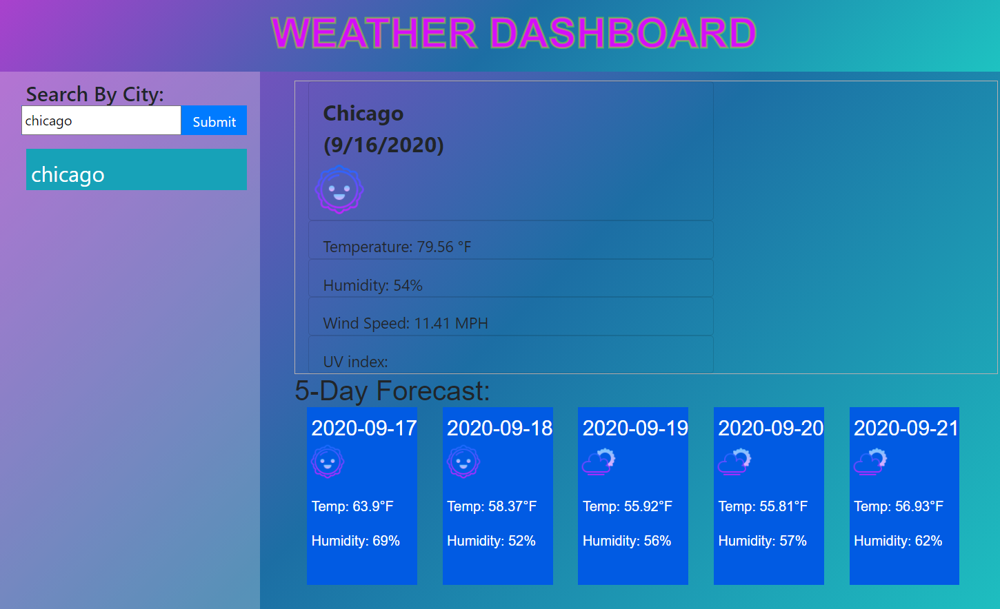

    
    ## Description 
    A simple and funky webpage which returns weather data for inputed location. 
    
    ## Table of contents
    * [Description](#Description)
    * [Installation](#Installation)
    * [Usage](#Usage)
    * [License](#License)
    * [Contributors](#Contributors)
    * [Test](#Test)
    * [GitHub Info](#Questions) 
    
    ## Installation
    No installation necessary, visit <a href="https://rebecca88oliver.github.io/Weather_Map/">Weather Map</a> to use the Weather Map.
    
    ## Usage
    This website can be used to check the weather of any location.
    ## License
    
    
    ## Test
    Enter a location in the "search" box and click the "search" button. The webpage will automatically load weather data.
    
    ## Questions
    For questions please contact rebecca88oliver@gmail.com.
    GitHub URL: https://api.github.com/users/rebecca88oliver
    

// Screenshot 

